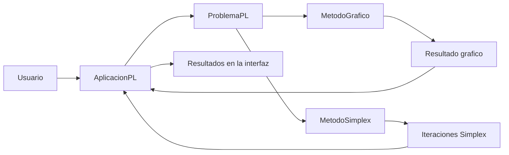
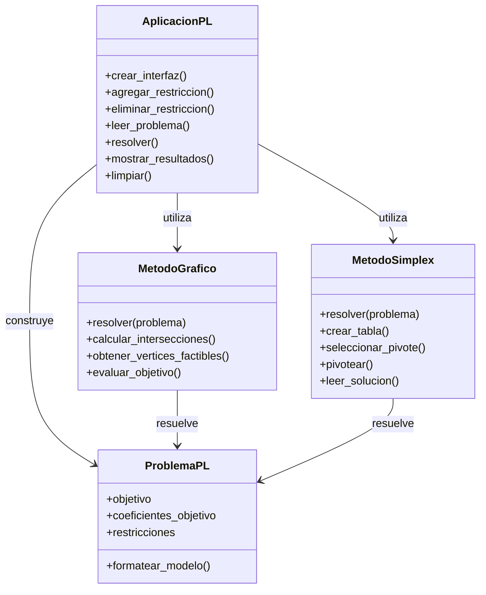
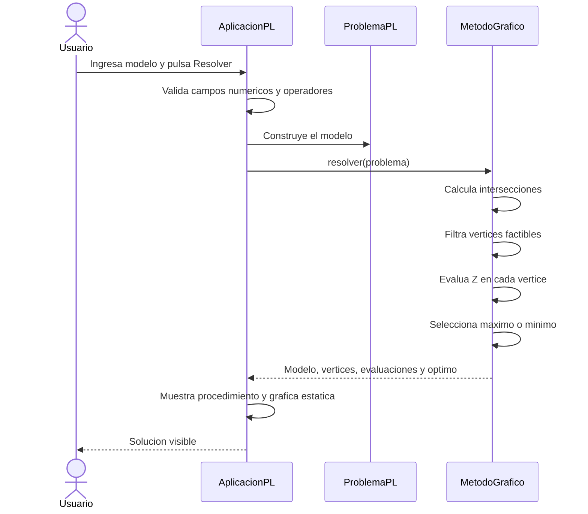
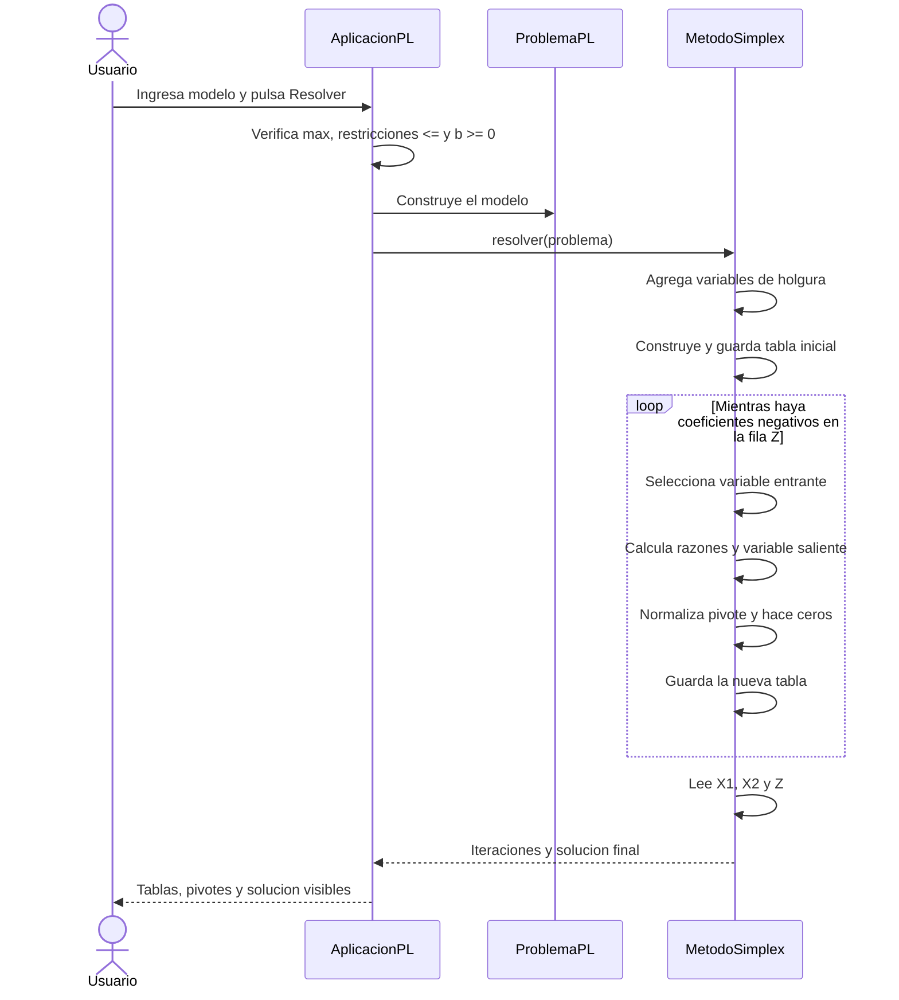

# DISENO DEL SISTEMA
## Calculadora de Programacion Lineal

**Version de diseno:** v0.1

**Alcance:** primera entrega

**Archivo principal previsto:** `programacion_lineal.py`

---

## 1. Proposito

Este documento define una arquitectura pequena y explicable para la calculadora.
El diseno permite desarrollar la aplicacion por etapas sin mezclar la interfaz,
los datos del problema y los dos metodos de solucion.

El programa final permanecera en un solo archivo Python, pero sus
responsabilidades se separaran mediante clases y metodos sencillos.

---

## 2. Decisiones de alcance

- Se trabajara exclusivamente con `X1` y `X2`.
- El metodo grafico resolvera maximizacion y minimizacion con restricciones
  `<=` y `>=`.
- Simplex v1.0 resolvera solamente maximizacion, restricciones `<=` y terminos
  independientes no negativos.
- Las transformaciones previas observadas en el taller, como
  `X1 = 20 + Y1` o `X2 = X1 + Y2`, no se automatizaran en v1.0.
- NumPy podra apoyar calculos pequenos, pero no reemplazara la logica de los
  metodos.
- Matplotlib se utilizara solo para la grafica estatica.
- La interfaz se inspirara en la imagen suministrada, sin intentar copiarla.
- No se agregaran exportacion, historial, persistencia ni casos especiales.

---

## 3. Arquitectura basica



Flujo general:

1. `AplicacionPL` lee y valida las entradas basicas.
2. Con esas entradas construye un `ProblemaPL`.
3. Segun la seleccion, entrega el problema a `MetodoGrafico` o
   `MetodoSimplex`.
4. El metodo devuelve datos y explicaciones; no modifica directamente la
   interfaz.
5. `AplicacionPL` presenta el procedimiento y el resultado.

---

## 4. Diagrama de clases



### Responsabilidades

#### `ProblemaPL`

- Guardar objetivo, funcion objetivo y restricciones.
- Mantener una representacion independiente de Tkinter.
- Producir el texto legible del modelo.

#### `MetodoGrafico`

- Generar puntos candidatos.
- Comprobar factibilidad y no negatividad.
- Eliminar puntos repetidos.
- Evaluar la funcion objetivo.
- Seleccionar el maximo o minimo.
- Devolver los datos necesarios para graficar.

#### `MetodoSimplex`

- Construir la tabla inicial con holguras.
- Seleccionar columna y fila pivote.
- Ejecutar operaciones elementales.
- Conservar cada iteracion.
- Leer `X1`, `X2` y `Z` de la tabla final.

#### `AplicacionPL`

- Crear y controlar la interfaz.
- Administrar las filas dinamicas de restricciones.
- Leer las entradas y mostrar errores sencillos.
- Seleccionar el metodo de solucion.
- Presentar texto, tablas y grafica.

---

## 5. Secuencia del metodo grafico



---

## 6. Secuencia del metodo Simplex



Si la entrada no pertenece al alcance de Simplex v1.0, la interfaz mostrara un
mensaje breve y no intentara transformar automaticamente el modelo.

---

## 7. Bosquejo definitivo de interfaz

La referencia visual usa un formulario vertical, dos restricciones iniciales,
botones `+` y `-` y una presentacion limpia. La aplicacion conservara esas ideas
y agregara los controles requeridos para ambos metodos.

```text
+--------------------------------------------------------------------------+
|              CALCULADORA DE PROGRAMACION LINEAL                          |
+--------------------------------------------------------------------------+
| Metodo:  [ Metodo grafico  v ]    Objetivo: [ Maximizar v ]              |
|                                                                          |
| Funcion objetivo:       Z = [ c1 ] X1 + [ c2 ] X2                        |
|                                                                          |
| Restricciones:                                                            |
|  1. [ a11 ] X1 + [ a12 ] X2 [ <= v ] [ b1 ]                             |
|  2. [ a21 ] X1 + [ a22 ] X2 [ <= v ] [ b2 ]                             |
|                         [  +  ] [  -  ]                                  |
|                                                                          |
|                    [ Resolver ] [ Limpiar ]                              |
+-----------------------------------+--------------------------------------+
| PROCEDIMIENTO Y RESULTADOS        | GRAFICA / AREA RESERVADA             |
|                                   |                                      |
| Modelo ingresado                  | En v0.2 permanece vacia.             |
| Vertices o tablas Simplex         | En v0.3 muestra Matplotlib.          |
| Solucion final                    | En Simplex puede mostrar una ayuda.  |
+-----------------------------------+--------------------------------------+
```

### Comportamiento segun el metodo

| Seleccion | Objetivo | Operadores | Salida principal |
|---|---|---|---|
| Metodo grafico | Maximizar o minimizar | `<=` o `>=` | Vertices, evaluacion y grafica |
| Simplex v1.0 | Maximizar, bloqueado | Solo `<=` | Tablas, pivotes y solucion |

### Reglas de interaccion

- La aplicacion inicia con dos restricciones.
- El boton `+` agrega una fila al final.
- El boton `-` elimina la ultima fila, conservando al menos una.
- `Resolver` sirve para ambos metodos; no se utilizara el texto `Graficar` de la
  imagen de referencia.
- `Limpiar` vacia los campos, restablece dos restricciones y borra resultados.
- Al seleccionar Simplex, el objetivo queda en maximizar y los operadores en
  `<=`.
- Los resultados aparecen en la misma ventana.
- Los errores basicos se muestran con mensajes claros, sin validaciones
  avanzadas fuera del alcance.

---

## 8. Estructura interna prevista del archivo Python

```text
1. Importaciones
2. Clase ProblemaPL
3. Clase MetodoGrafico
4. Clase MetodoSimplex
5. Clase AplicacionPL
6. Punto de entrada del programa
```

Las clases de los algoritmos se incorporaran solamente cuando corresponda a su
fase. En v0.2 bastaran `ProblemaPL` y `AplicacionPL` cuando cada una sea necesaria.

---

## 9. Criterios para aprobar el diseno

- Cada responsabilidad tiene un unico lugar claro.
- La interfaz contempla todas las entradas y salidas de los requisitos.
- Los diagramas corresponden con el flujo que se implementara.
- El diseno no incluye funcionalidades futuras.
- El estudiante puede explicar el recorrido desde la entrada hasta el resultado.
